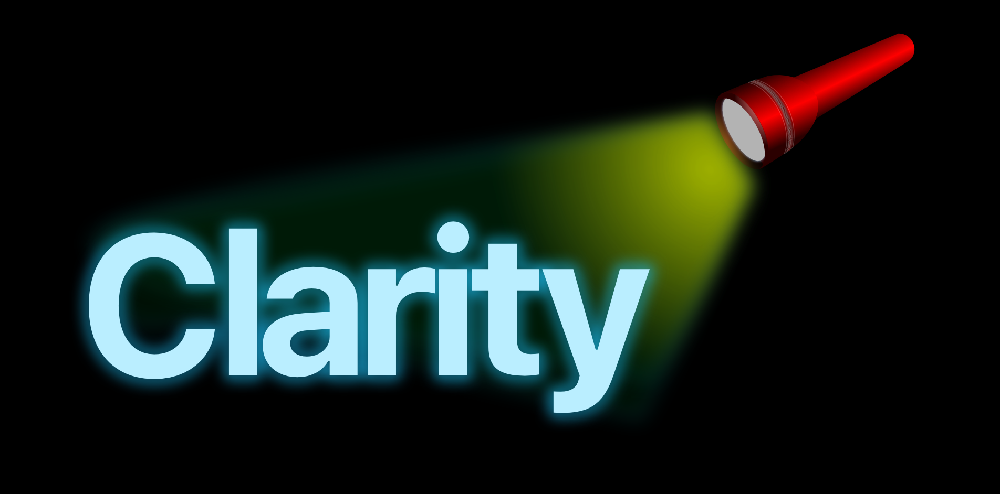

[](https://opensource.org/licenses/MIT)[](https://www.paypal.com/cgi-bin/webscr?cmd=_s-xclick&hosted_button_id=9ZGWNK5FEZFF6&source=url)

**Clarity** is a logging framework that prints log data referenced from JSON by number and displays the output in the console using semantic formatting.  

### Source code

```swift
//Clarity print statements in source code
print(1, functionName: #function)
print(2)
print(3, values: [ 1,2,3])
```

### Console output

``` 
MYCLASS  🏓f   52    myFunction()
MYCLASS        52    N-2    ✅  - An event occurred that is described here
                                  Effect: 'this' will happen next
MYCLASS        52    N-3    📋  - Values for variable are:
                                  1
																	2
																	3																	
```

## Overview

Clarity assumes three main ‘nodes’ of developer interest in an application control flow: function call points, the resolution of conditional statements and the reporting of specific values including errors. Clarity print statements are designed to be placed at such node points in the client application source code.

All message data relating to each print statement is placed entirely in associated JSON files referenced by a unique number. This enables the printing of an unlimited amount of information to the console with negligible impact on the source code.

The customisable formatting of console log output is designed to emphasise nodes of interest in a **clear narrative of the control flow.** The output includes symbols that relate to the functionality and purpose of the code such that it is human readable and understandable at first sight.

Customisable filter settings enable the printing of specific isolated elements and referenced data.

The minimal API consists of two overload analogues of the Swift [`print(_:separator:terminator:)`](https://developer.apple.com/documentation/swift/1541053-print) function – these functions: [`print(_:functionName:settings:)`](https://realint.org/documentation/clarity/print(_:functionname:settings:) and [`print(_:values:settings:)`](https://realint.org/documentation/clarity/print(_:values:settings:) reference associated JSON data via an index.

New to Release 2 are two functions for use when working with Combine publishers: [`print(_:valuesForPublisherType:settings:)`](https://realint.org/documentation/clarity/print(_:valuesforpublishertype:settings:) and an extension overload of [`print(_:to:)`](https://developer.apple.com/documentation/combine/publishers/receiveon/print(_:to:)/).

## Documentation

Clarity is fully documented in a DocC catalogue that includes [articles](https://realint.org/documentation/clarity/), [public API reference](https://realint.org/documentation/clarity/) and [tutorials](https://realint.org/tutorials/clarity).

The non public API is 100% documented using [Jazzy](https://realint.org/claritydevdocs/index.html).  

## Installing

Clarity is best [installed as a Swift Package](https://realint.org/tutorials/clarity/install-as-a-swift-package).

[](https://www.paypal.com/donate?hosted_button_id=2TUDLD6PMKUDN)

## License

Clarity is released under the MIT license. [See LICENSE](https://github.com/real-intelligence/Clarity/blob/main/LICENSE) for details.

Copyright (c) 2021-2022 Lawrence Heyfron https://realint.org/
