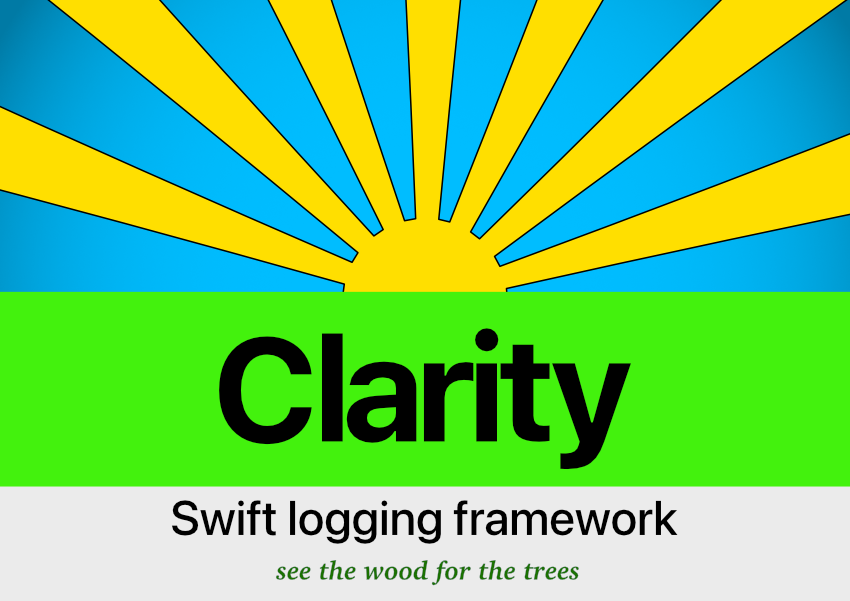
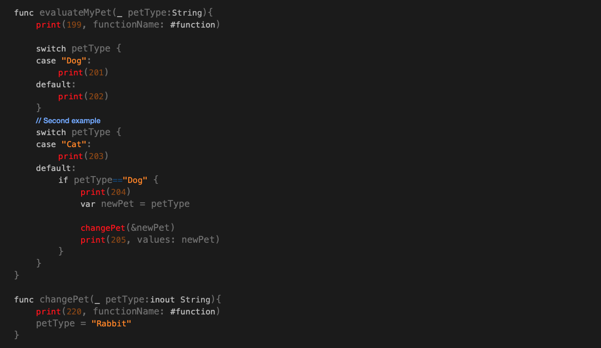
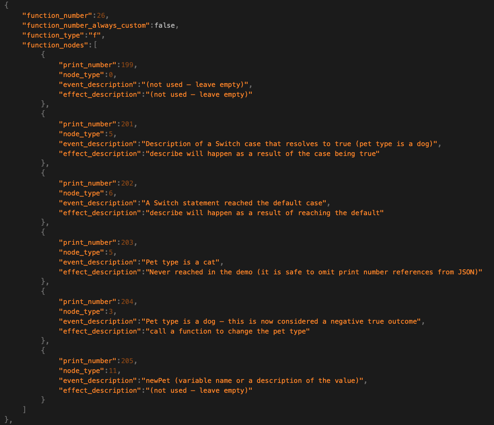
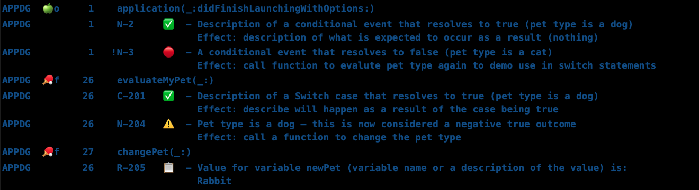
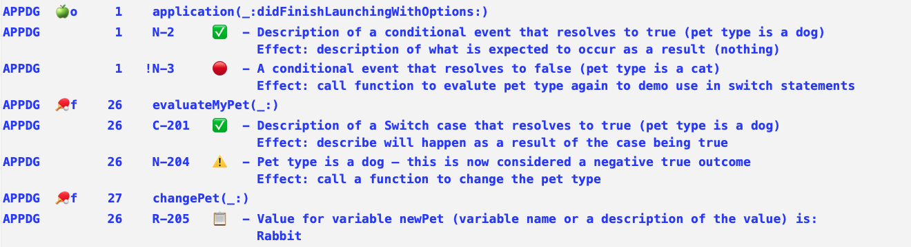
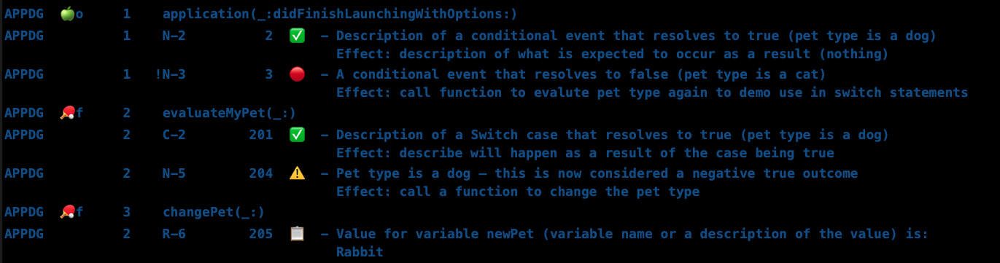
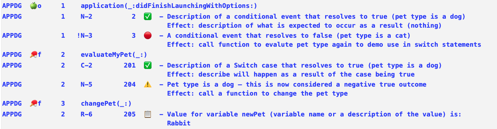
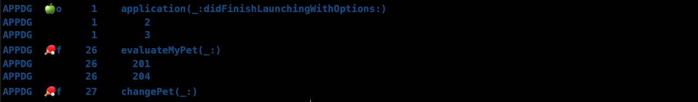
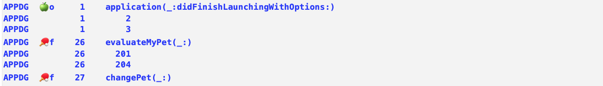
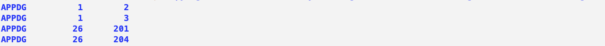

[](https://opensource.org/licenses/MIT)[](https://www)[](https://www.paypal.com/cgi-bin/webscr?cmd=_s-xclick&hosted_button_id=9ZGWNK5FEZFF6&source=url)

## Introduction

**Clarity** is a logging framework that prints log data referenced from JSON to the console using semantic formatting.

Clarity assumes three main ‘nodes’ of interest in an application control flow: function call points, the resolution of conditional statements and the reporting of specific values including errors. Clarity print statements are designed to be placed at such node points in the client application code.

All message data relating to each print statement is placed entirely in associated JSON files referenced by a unique number. This enables the printing of an unlimited amount of information to the console with negligible impact on the source code.

The log output formatting is designed to emphasise nodes of interest in a clear narrative of the control flow instantly understandable by anyone – including non-developers. Settings enable the isolation of specific elements and referenced data. 

Fully native and compatible with all Apple platforms, 100% stable, lightweight, and lightning fast – Clarity is a must-have framework for all Xcode projects.

## Table of Contents

- [Features & Benefits](#features)
- [Usage](#usage)
- [Structure of Clarity print statements](#structure)
- [Requirements](#requirements)
- [Installation](#installation)
- [Activation](#activation)
- [Reference & Docs](#reference)
- [Donations](#donations)

## Features

🔆 **Complete granular control of all logs printed to the console**: 

- isolate entities, functions or collections of specific print statements. 
- display function names or control nodes only.
- switch all printing on or off.
  

🔆 **Deactivate printing for release without removing print statements**:

- Keeping Clarity print statements intact yet inert in the code source.
  

🔆 **All print log data is separated from the source code**: 

  - each JSON data point is referenced by a single unique print number. 
  - the JSON data is accessed as project files that are editable within Xcode.
  - significantly reduce the chance of introducing regressions through accidental deletions such as can occur when editing print statements in source.
    

🔆 **Public API with a negligible footprint to help maintain clean code**: 

  - overloads the familiar Swift print() function. 
  - simple, quick and intuitive to add log references.
  - reduces the impact of logging on source code to the absolute minimum.
    

🔆 **Print statement output designed to be easily read as a clear narrative of the control flow**: 

  - control flow logs printed as concise 'event – effect' pairs. 
  - each statement tagged by entity code, function and print number.
  - quick to find nodes of interest in the code using the tags.
    

🔆 **Print statement output formatted using semantic assignment of symbols**: 

  - aids clear visual detection of unexpected events or anomalies in the control flow. 
  - semantic symbols can be set to coloured Apple symbols.
  - fully customisable settings for formatting, symbols and display.
    

🔆 **Values and Errors can be passed as arguments to print statements**: 

  - values displayed formatted as an easily readable list. 
  - LocalizedErrors automatically displayed as a NSLocalizedString written for the specific custom error case.
    

🔆 **Custom or relative numbering system for tagging functions and control flow nodes**.


🔆 **Number tag sequence only display:**

  - concise and space efficient yet potentially comprehensive list of control flow nodes. 
  - track paths through complex algorithms. 
  - trace the source of intermittent errors using overlaid transparencies.
    

🔆 **SwiftUI support:**

  - print output from within `body` vars and view modifiers. 
    

🔆 **Written entirely in Swift without third party dependancies.** 


🔆 **Easy to install and use:**

  - unambiguous instructions
  - no terminal use, build phase scripts or third party application required. 
    

🔆  **Comprehensive API docs [website](https://clarity.developer.realint.org)  and reference [documentation](Documentation/Documentation.md) provided.**

  

## Usage

Use judiciously as a tool for logging print statements during project development or comprehensively at all node points to gain rapid understanding of an existing third party code base.

### Screenshots from example project

#### Clarity print statements in source code

 

#### Log JSON data associated with the print statements



#### Log output for the print statements

##### Dark mode  



##### Light mode  



Note: the source and associated JSON extracts depicted above are for print statements in **evaluateMyPet(_:)** and **changePet(_:)**  : the console also shows output from print statements in **application(_:didFinishLaunchingWithOptions:)** – see  [example code](iOS App Delegate Example) for full details.


#### Display log output using relative numbering including additional display of (absolute) print numbers 

ClarityJSON > **Settings.json**
All other keys set to false

| Key                                              | Value |
| ------------------------------------------------ | ----- |
| calculateFunctionNumbersRelativeToEntity         | true  |
| calculateNodeNumbersRelativeToFunction           | true  |
| displayNodePrintNumberWhenUsingRelativeNumbering | true  |

##### Dark mode



##### Light mode




#### Display log output as number sequence without descriptions – including function names

ClarityJSON > **Settings.json**
All other keys set to false

| Key                                    | Value |
| -------------------------------------- | ----- |
| displayNodeSequenceWithoutDescriptions | true  |

##### Dark mode

 

##### Light mode




#### Display log output as number sequence without descriptions – control nodes only

ClarityJSON > **Settings.json**
All other keys set to false

| Key                                    | Value |
| -------------------------------------- | ----- |
| suppressLogFunctionNames               | true  |
| displayNodeSequenceWithoutDescriptions | true  |

##### Dark mode

 

##### Light mode



The different display options are controlled using a combination of keys in the [Settings](Documentation/Settings.md) json file, the [Formatting](Documentation/Formatting.md) json file and keys within the associated [EntityLogService](Documentation/EntityLogService.md) json file.

See additional examples of using different node types and display options and the resulting console output in the [documentation](Documentation/Examples.md).


## Structure


### Clarity print statement node type grouping inclusions and 'column' alignments

|                              | CS1  |             |                        | CS2  |                 | CS3  |                    |             |                                 | CS4  |                                 |                   |
| ---------------------------- | ---- | ----------- | ---------------------- | ---- | --------------- | ---- | ------------------ | ----------- | ------------------------------- | ---- | ------------------------------- | ----------------- |
| **Node type grouping:**      |      |             |                        |      |                 |      |                    |             |                                 |      |                                 |                   |
| **Function name**            |      | Entity Code | Function ‘type’ symbol |      | Function number |      | Function name      |             |                                 |      |                                 |                   |
| Line 1:                      |      |             |                        |      |                 |      |                    |             |                                 |      |                                 |                   |
| **Control flow / Reporters** |      | Entity Code |                        |      | Function number |      | Node ‘type’ symbol | Node number | Print number (relative setting) |      | Outcome/ Reporter/ Error symbol | Event description |
| Line 2:                      |      |             |                        |      |                 |      |                    |             |                                 |      |                                 |                   |
| **Control flow**             |      |             |                        |      |                 |      |                    |             |                                 |      |                                 | Event description |
| **Value Reporter**           |      |             |                        |      |                 |      |                    |             |                                 |      |                                 | Value(s) list     |
| **Error Reporter**           |      |             |                        |      |                 |      |                    |             |                                 |      |                                 | Error description |

The 'CS' row marks the position of custom spacers (with a default value of 0).


## Requirements

| Platforms                                          | Minimum Swift Version | Installation                                                 | Status       |
| -------------------------------------------------- | --------------------- | ------------------------------------------------------------ | ------------ |
| iOS 14.5+, macOS 11.2+, tvOS 14.5+  , watchOS 7.4+ | 5                     | [Swift Package Manager](#swift-package-manager), [XCFramework](#xcframework), [Embedded Framework (using git submodules)](#embedded framework) | Fully Tested |


## Installation

### Swift Package Manager

- Xcode > File > Swift Packages > **Add Package Dependency**...
  or Project navigator > PROJECT > Swift Packages > **click add (plus) icon** – Add Package Dependency
- Choose Package Repository > Search or enter package repository URL (browser) > enter ...
   `https://github.com/real-intelligence/Clarity.git`
- Rules > check Version: **Select Up to Next Major** >  ( Xcode will automatically fill latest tag number )
- **Next...**
- Choose package products and targets: Package Product > **ensure Clarity is checked** 
  Add to Target > **select YourProject name** 
- **Finish**


### XCFramework

Each release will include a `clarity.xcframework` framework binary.

- Navigate to **latest** release > https://github.com/real-intelligence/Clarity/releases

- (select) Assets > **Clarity.xcframework.zip**

- Doubleclick the downloaded zip file > move **Clarity.xcframework** to a convenient location.

- Open > YourProjectName… 

- Project navigator > ProjectName > TARGET > ProjectName > **General Tab**...

- Finder ... > select Clarity.xcframework  >  Drag and drop into the **Frameworks, Libraries, and Embedded Content**
  or **Frameworks and Embedded Content** of a client ProjectName if it is itself a framework.

- **Cmd+B** to build the project.

  
  

### Embedded Framework 

Ensure that your project is initialized as a git repository.

- Navigate to your project root folder > (right click) **New Terminal at Folder**

- Add Clarity as a git [submodule](https://git-scm.com/docs/git-submodule) by running the following command:

  ```bash
  $ git submodule add https://github.com/real-intelligence/Clarity.git
  ```

- Your project root folder > Clarity > (Select) **Clarity.xcodeproj** 
  Drag the icon into the Project Navigator of your application's Xcode project

- > It should appear nested underneath your application's blue project icon.

- Project Navigator > Clarity.xcodeproj > PROJECT >  **Deployment Target** ...
  Ensure the specific platform deployment target matches (or is less than) your application target

- Project Navigator > Your project (xcodeproj) > TARGETS >  General > **Frameworks, Libraries, and Embedded Content**

- Click **Add Items** (plus icon)

- (select) **Clarity(relevant platform).framework** 


## Activation

1. Add the Clarity activation initialiser at the entry point of the client application.
   
   
   Important: The Clarity activation initialiser should only be called once in an application.
   
   Note: if the `displayStatus` parameter is omitted or set to `true`  – the print mode and activation status of Clarity will be displayed at the top of the console output on initialisation.
   
   
   
   ### SwiftUI App 
   
   Create a custom initialiser (if one does not already exist) for the type annotated with the `@main` attribute that conforms to the `App` protocol (the entry point of the application). 
   
   - Add the Clarity import statement.
     Note: Swift Package installations require `import Clarity` for all platforms
   
     XCFramework installations will require platform specific imports: 
   
     - **macOS** :  `import Clarity` 
     - **iOS** : `import Clarity_iOS` 
     - **WatchOS** : `import Clarity_watch` 
     - **tvOS** : `import Clarity_tv` 
   
   - Add the Clarity activation initialiser.
   
   ```swift
   import Clarity
   
   @main
   struct ClientForBigSuriOSApp: App {
   init() {
    ClarityActivator(withBundle: Bundle.main, inPrintMode: true, displayStatus:false)
     ...
   }
   ```
   
   
   
      ### App Delegate
   
   Add activation to `application(_:didFinishLaunchingWithOptions:)`
   
      ```swift
   import Clarity
   ...
   
   func application(_ application: UIApplication, didFinishLaunchingWithOptions launchOptions: [UIApplication.LaunchOptionsKey: Any]?) -> Bool {
         
    ClarityActivator(withBundle: Bundle.main, inPrintMode: true, displayStatus:false)
   	...
   }
      ```
   
   
   
   ### Framework as a client application
   
   Framework applications that have a single entry point or activation method should activate Clarity in the same way as shown above in the entry point method implementation.
   
   Note: Framework applications will need to call the Bundle initialiser `init(for:) ` supplying the implementing class as argument to the `aClass` parameter to access the correct Bundle for the framework.
   
   
   
      #### Framework as a client without a single entry point
   
   Framework applications that do not have a single entry point will need to implement a class that includes a static variable that lazily stores the result of a closure containing the activation initialiser. The closure will then need to be accessed by all classes, structs or enums that use Clarity. This technique ensures that Clarity is activated only once and that any failure to activate Clarity will not adversely affect the client framework.
   
   
   
      ```swift
   //Activation
   import Clarity
   
   class ClarityServiceExample {
   
    static let clarityActivation: ClarityActivator? = {
       return ClarityActivator(withBundle: Bundle(for: ClarityServiceExample.self), inPrintMode: true)
     }()
   }
   
   //Accessing the activation
   import Clarity
   class MyClass {
               public init() {
               // All other essential initialisation work here …
   
                guard let _ = ClarityService.clarityActivation else{
                    print("Clarity activation failed")
                    return
                }   
                // Place a Clarity print statement for the initialiser here if required.
            }
     
         // Clarity print statements can now be placed anywhere in the class (struct or enum) as usual.
   }
      ```


2. Run the client application in any Xcode device simulator. 

   A folder containing template and default settings JSON files named **ClarityJSON** will be copied to the desktop.

   Note: running Clarity for the first time in a macOS application will likely cause a denied permissions issue when attempting to copy ClarityJSON to the desktop. 

   In this situation either temporarily switch the scheme to run once in a simulator or download the folder named **TemplateJSON** from the GitHub repository or locate the copy of the folder in the client project DerivedData, rename the folder to ClarityJSON and then continue to follow the instructions below (that are also given in the console).

2. **All platforms except watchOS:**
   Drag the folder named ClarityJSON from the desktop into: Xcode > Project Navigator > under (as a child of) the ProjectName icon.
   
   **watchOS only:**
   Drag the folder named ClarityJSON from the desktop into: Xcode > Project Navigator > under (as a child of) the ProjectName **Watchkit Extension** folder.

2. In the pop up window:


   - check Destination: **'Copy items if needed'**
   - select '**Create folder reference**' 
   - check 'Add to targets:' > 'ProjectName'

   **All platforms except watchOS:**

   Xcode should place the directory at the top level of your project in the same directory containing the **.xcodeproj** file.

   **watchOS only:**

   Xcode should place the directory in the top level of the **Watchkit Extension** folder.

   In all instances the folder should be coloured blue.

2. Copy and rename the EntityLog json template files for each entity (struct, class or enum) where Clarity print statements are required. Additional EntityLog json files can be added at any time.

   Copy or move **ExampleEntityLog.json** to a separate location for reference and delete it from the ClarityJSON folder.

   Note:  Settings.json and Formatting.json must NOT be renamed, deleted or have their keys altered (the default values can be edited).

2. Add Clarity print statements to the project source code as required.

   

## Reference

All reference materials can be found in the [Documentation](Documentation/Documentation.md) folder.

Full developer API docs can be found [here](http://clarity.developer.realint.org).

Public API docs can be found [here](http://clarity.publicapi.realint.org). 

## Credits

**Clarity** – created and maintained by **Lawrence Heyfron**. 

## Contributions

If you like Clarity and want to support the project please let other developers know that the framework exists – tutorial creators are especially encouraged! 

Feedback, code contributions, issues and pull requests including unit tests that add to the test coverage are welcomed. By making contributions to this project you give permission for your code to be used under the same [license](LICENSE.md).

### Contribution guidelines

* Make a separate pull request for each new feature or bug fix.
* Include descriptive commit messages.
* Include unit tests that cover each new feature. 

It would be great to know about projects using Clarity!

 https://realint-org.slack.com

## Donations

If you would like to support the maintenance of Clarity by making a donation any amount would be greatly appreciated.

If you use Clarity within an organisation or company ask if your employer might consider donating.

[](https://www.paypal.com/donate?hosted_button_id=2TUDLD6PMKUDN)

## License

Copyright (c) 2021 Lawrence Heyfron https://realint.org/

Clarity is released under the MIT license. [See LICENSE](LICENSE.md) for details.

[Back to top](#introduction)

